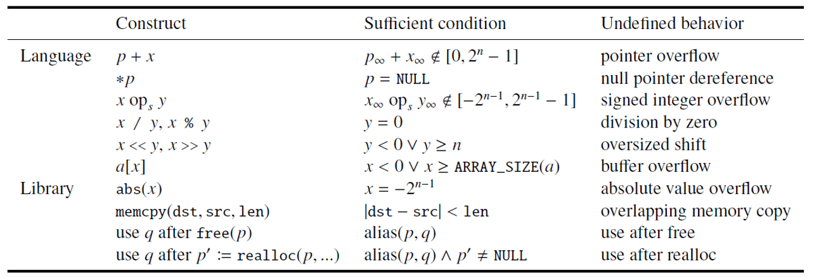
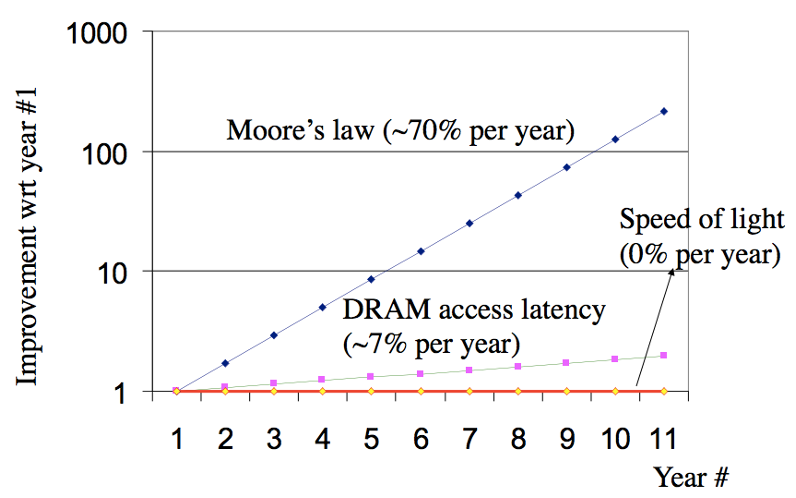
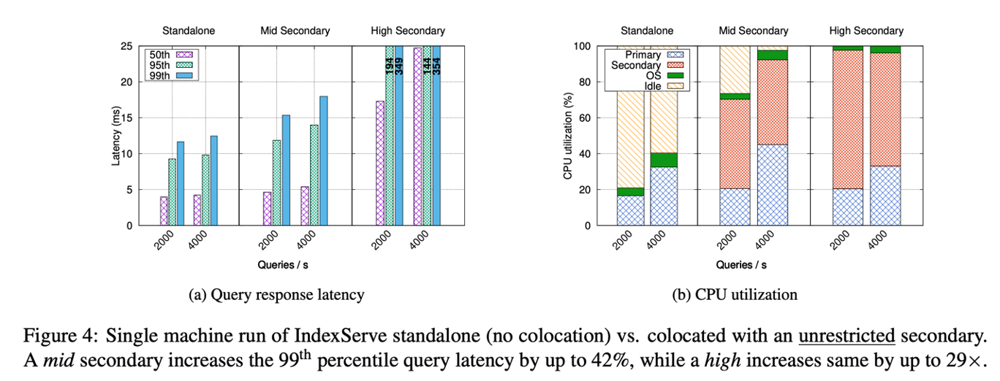
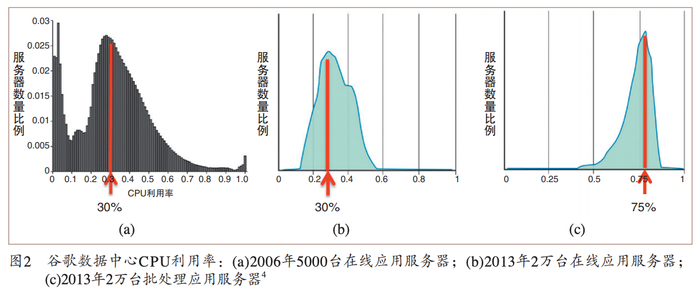

import OfficePreview from '@site/src/components/OfficePreview/index';

<OfficePreview place = "/ppt/CSE-01-intro.pptx"/>

## 第一章 简介

> CSE 每年都会做一些改动，每年上课内都不太一样。上课就跟 build 一个很大的系统一样，很多时候他必须得 cope with complexity 复杂性

### 一、数字世界

#### 1）两个视频

两个视频：重点并不在于notion，而不在于ChatGPT，而在于这两个人都是数字生成的，就是他们所说的每一句话，他们的每个表情、每个动作的话其实都是生成的，那么并不是。

我们会发现这个数字世界已经把这个真实世界和这个数字的虚拟世界进行一些融合，而当你在这个融合的世界里面看到对面的一个人的时候，其实你可能分辨不出来它是一个真的人和一个假的人。

意味着更高的效率，意味着不需要经过长途的跋涉，我们就可以看到一个我们想看的一个人，意味着很多很多的这个可能性。

#### 2）蓝屏/事故?

几个例子：

- 叮叮当时撑到最后还是崩溃了，支付宝在 2015 年的5月 27 日的下午，曾经大规模的这个宕机。整个支付宝如果你要支付的话，它就处于一个中间，有一个spin，就是有一个圆圈在一直转，然后就告诉你无法支付。那为什么呢？是因为杭州市的萧山区这个光纤被异常的挖断。
- 光纤被挖断，会在我们这门课里面多次出现，我觉得我们甚至应该给我们这门课设计一个logo，就是一个光纤被铲子挖断的一个瞬间。这个画面可以提醒我们这个意外无处不在，复杂事件很多可能都会出现。
- 更严重的这个事故（导致了人命的这个这个丧失）：Therac-25 事件，由于软件的bug（race Condition，ICS讲过），导致了它一个机器的辐射量过大，本来是用辐射去精准的消除一些肿瘤细胞，但是如果辐射过大的话，就会导致整个人接受不良的辐射，而受非常不可逆的这个损伤。
- Ariane 5 号火箭有一个浮点 FLOATING point 的一个bug，起飞之后的话爆炸了（ICS的课程例子哦这个是！）
- Jeep自由光系统存在入侵风险，菲亚特克莱斯勒汽车公司召回140万辆汽车
- 我们对于系统复杂性的驾驭是不是真的能够支撑我们一步一步的往到这个这个不可逆的方向这个前进？所以我们就要谈一下 system 和这个complexity。

#### 3） System 与 Complexity

-  system：其实是一个不太好定义的这么一个概念， system 就是一组component， component 他们是具有和环境交互的一组特定的行为，通过这个接口和环境有一组特定的行为。
  - 外部：复杂
  - 内部：复杂
- complexity：这里的一个矛盾是什么呢？就是我们人脑的理解能力是有限的，虽然大家的理解能力会有些差异，但这个差异的话依然是可在一个相对来说比较小的范围之内，而系统的复杂度则是没有边界，它可以很复杂，所以我们的脑子就没有办法去理解这个系统到底是如何 work 的
  - Linux的代码不断增加，合在一起都 2000 多万行代码。差不多和一个老鼠的基因是差不多的。

系统的思维：

- 当我们研究一个分子的时候，我们能够得到这个分子的什么属性？我们能够得到它的质量，它的方向，最后变成它的这个动量
- 一瓶气体里面有很多个气体的分子，这个时候如果我们还是用研究一个分子的方式去研究这个瓶子里面的气体，显然是不对的，因为它太复杂了。
- 所以我们研究温度，大家还记得温度的定义吗？温度体现出来的是气体分子的平均运动速度，对不对？
- 你说我这有一个气体分子，它的温度是多少没有意义，但是当我们有一瓶气体的时候，在宏观上就体现出来了一个在微观上所不具备的一个属性，可以被我们人测到的一个属性，而且能够反映出速度的这样一个属性，那就是那是温度。
- 当我们的代码行数从很少的几十行，我们平时写的 lab 几十行、几百行到几十万行、几百万行、几千万行的时候，会不会出现一个类似于温度这样的属性，让我们去测量这个系统
- 而不是一行代码去看待这个系统。当我们把一个系统里面的 CPU 的数量从一个和变成几十个、几百个、上千个核，当我们有一个很大的集群，有几十万个核的时候，这个系统，这个cluster，这个 data center，它所体现出来的一些 property 就不再是一个核所体现出来的property。
- 网络，对于两个节点组成的网络和对于整个世界、整个地球上的Internet，所以这么多节点连在一起形成的网络，它们的属性是不是也会产生这样一些新的这个property？
- 还有就是 Web Server，我们在 ICS 的时候做过一个 lab 叫做 Web Server，你们的 Web Server 能够支撑每秒钟多少个CLient？如果说要到几百万，那可能一台机器这个 Web Server 它就不是我们这么去设计的。所以这个量的变化带来了质的变化
- 当一个系统复杂到几千万行代码，我们有哪些类似于温度的 property 可以去形容、描述、追求的这样一些属性？这就是我们这门课的两个轴
  - 第一个轴（x轴）：不同的System
  - 第二个轴（y轴）：不同的property（上面说的类似温度的）

### 二、14个属性

#### 1）总述

- 正确性、时延、吞吐量（并发）、Scalability（延展性）、Utilization（把资源好好的利用起来）
- Performance Isolation（性能隔离、互补干扰）、Energy Efficiency高效
- Consistency、Fault Tolerance、Security、Privacy、Trust、Compatibility、Usability

#### 2）Correctness正确性

> 正确性大家觉得是一个最基本的要求，应该是一件很容易判断的事情。事实上其实并没有那么容易判断。有人说：「It's not a bug, but a feature」

- 例子一：

  - 比如说在 Windows 11里面，当你打开一个资源管理器的时候，双击F11，性能可以提高400%（这是六天前的一个新闻）
  - F11 就全屏，再按一下就退出全屏，它差不多就是这样一个过程。好，那么对于这样一个过程来说的话，为什么它就快了？全屏的时候他一下子就觉得优先级高了，然后给他更多的资源还是什么，对吧？让他的这个响应速度变快一些。你们觉得这是 bug 还是feature？

-  例子二：

  - Linux登录的界面按 28 下推位键，你就可以不用密码登录了。但这个 bug 已经被 fix 了，大家现在去看的话，应该已经没什么太大的这个作用了。

- 例子三：指针溢出与Undefined behavior

  - 看下面的代码：

    ```c
    char *buf = xx;
    char *bufend = xx;
    if(buf + len >= bufend)
      	return; // 说明因为输入过长，导致越过了buffer end
    if(buf + len < buf)
    		return; // 说明产生了溢出，len的长度可能过大
    // 开始往buf[0]~buf[len - 1]里面写入数据
    ```

  - 这个代码看似非常好，考虑了所有的情况，但是`gcc`的人建议说：把第五行、第六行代码删掉为什么？

  - 指针溢出是一种C语言手册里面的Undefined behavior，也就是说Undefined behavior的最终行为是要depends的，看情况来说的，比如随着编译器优化的情况，会有不同的汇编代码。

  - 编程的时候要小心，不要写出Undefined behavior的行为

  - 这个工作当时用了很多不同版本，包括GCC，包括不同版本，包括加杠 O1 跟杠O1，O2，O3，一个个去试发现都不一样，对于undefined， behavior 都是depends，而且它还没有一个warning，所以这其实给我们很大很大的一个震撼。我当时看到这篇论文的时候，我觉得从此之后安全感就很难建立起来了。



> 补充：[Compiler Explorer (godbolt.org)](https://godbolt.org/)这个网站可以用来测试不同的编译器。如下图所示。
>
> - 没有开O2的时候，是会老老实实的计算x+1的值
> - 开了O2的时候，直接就会`ret 1`，所以这就是Undefined behavior


大家想一想，我们的自动驾驶的软件是通过 GCC 编出来的，你真的会一行汇编的去看是不是编出来的和你 c 写的代码一样吗？所以我想说的一点是，关于 correctness，有时候哪怕是表现，我们也不知道它是 bug 还是feature。有时候对于一个我们看上去是完全正确的一个代码，但实际运行的时候我们看不到的二进制，它可能和我们所写的代码是不一样的，而不同的编译器的行为也有可能是不一样。

#### 3）latency延迟

这个 latency 它很难去优化，我们说如果我们要有更多的性能，我们第一反应是卖更多的机器就可以了，但是要缩短Latency，是一件很难的事情。

- 摩尔定律告诉我们，单位面积上我能够集成的晶体管的数量18个月翻一番
- 但是 DRAM 的 access latency的话却只有每年7%的优化，这个是十倍的这个差距，这个十倍的差距的话会带来非常大的一个gap。
- 越往后大家看这个随着年数增加，它越往后它 gap 就越大。



#### 4）Throughput / Capacity

> latency延迟是性能里面最难压缩的一个，其次是Throughput / Capacity。

- 单位面积晶体管数量增加，本身就是一种 Capacity的增加
-  7 纳米、 5 纳米、 3 纳米、两纳米就不断在工艺在减小，意味着单位面积又可以增加，所以它其实是我们的预期，其实是一直就指数结尾上涨。
- 但是到现在我们说这个快到头了，所以美国人才要各种限制了，那快到头了它也增长不了太多了，那怎么办？那只能给你卡一下，所以这是他们说的这个点。

#### 5）Scalability

> CPU的核心数量越多越好吗？不是

这段代码运行在华为的一台服务器，是华为的这个鲲鹏系列的服务器上，它其实有 64 个核心。我们写了一个Benchmark，这个 Benchmark 它会有一把锁，就这个 Benchmark 就是一个应用程序，它其实是要更新一个东西，然后大家因为同时要更新，所以要拿锁。

我们ICS的时候学过锁，理想性能是什么呢？是随着CPU核数的增加，性能的话应该是成正比，但是超过了12个核心的时候，直接就掉到反而不如一个核心！为什么？

多核的时候，为了保证每个核看到的内存都是最后一次写入，必须要在多核之间有一个协议，告诉所有的核哪个数被改了，而这个数是什么呢？就是这个锁，当这个锁在一个多核情况下被修改的时候，有大量的 Cohere 在这个多核之间传递，而这个速度就会大大的这个降低


#### 6）Performance Isolation

> 性能隔离，如下图所示



一个应用程序在单独跑的时候，延迟比较低，但是和一个稍微吃性能的程序一块跑，延迟就被带大了，如何优化这个也是我们要考虑的。

#### 7）utilization

我们国家有很多数据中心，问题是我们建了这个数据中心之后，它的 CPU 利用率常年维持在30%，服务器数量的这个比例也是差不多。2013 年上到这个 75% 了，有些增长，但是依然是离我们希望的 90% 或者更高还有很大的差距。

我们一边在说我们需要算力对不对？我们需要吹一个大模型出来，一边这边又是这个都没用满，这是一个矛盾。这就是我们的utilization没怎么提高



#### 8）Energy Efficiency

台式机、服务器插电使用，无所谓。但是笔记本、手机，这种我们就要考虑电池了。怎么样去实现一个系统的这个 energy efficiency

#### 9）Compatibility兼容性

系统会不断的进化，但是如果我们进化之后的结果是不再兼容，那就要做好非常非常沉重的这个后果的这个预期。

Itanium芯片看上去很高级对吧？听过同学给我举下手？没听过？说明它是一个很失败的处理器。是英特尔当时推出的最先进的一款 CPU 比当时的奔腾还要先进。本来是要取代奔腾，但是当时是 32 位到 64 位转型的一个关键的时间节点，当时 32 位大家都知道不够了，但是怎么上 64 位，有两种方案。

第一种方案我们完全搞一套新的 64 位的指令集，使用了当时最先进的叫 VLIW very long instruction word 超长指令集。这个超长指令集它的作用是把 CPU 造的越快越好，尽可能快，不要去在 CPU 内部做各种各样复杂的逻辑，而是把一些重要的一些优化让编译器去做。这个理念到现在为止还是很先进的，就是让软件充分的去分析程序并行的可能，然后生成的这个代码又已经是最优的了，然后处理器只要想着我怎么去运行这个代码就行了，而不是在处理器的内部再去做一些这个优化。而以前奔腾的话就处理器内部有很多优化的这个点，导致它性能很多时候受到了一些这个掣肘。

但是这条路的话就意味着和以前的所有的这个 X86 的这个指令都不兼容，你只能通过二进制翻译的方式去做这个事。这个 compatibility 就导致了这个安藤（Itanium）最后就失败了。

成功的是谁？成功的是AMD，所以今天我们的 64 位的处理器叫 AMD64，是因为 AMD 就比较保守，他所提出的 64 位的这个方案的话是兼容以前的 32 位方案，这样的话就存活下来。以前英特尔一直嘲笑MD，说你们完全没有任何技术，所有的 X86 都是我一开始发明，你们没有提出过一条新指令，这是以前嘲笑 AMD 的时候，结果有了 AMD 64 之后，他成为了事实标准，英特尔不得已 follow 的这个标准。

从此之后英特尔说我们叫他改个名，我们叫 X 8664 好不好？然后所以我们有时候可以看到两个，一个叫 X 8664，还有一叫 AMD64。

####  10）usability

早期的 Windows phone，当时这个叫PDA，个人数字助理拿起一个PDA，眼睛不好的老先生就会眯着眼睛看，为什么呢？因为字很小，然后手还没法直接点，为什么呢？一手点容易出错，所以要从旁边抽一支笔出来，然后去戳那个屏幕。这个还是基于微软他以前的这种鼠标键盘的这种操作的思路，他觉得操作这个东西总得有一个像鼠标一样东西去点双击。

但是我们知道 iPhone 一代完全和这个不一样，对不对？随便你拨打都能操作，你按错了一点点也没事，它可以自动纠错过来，充分考虑到手指的这个点，这是 usability 带来这个好处，

所以我们一个好的系统，它的 usability 也非常重要，否则的话就会像今天的 Windows phone 一样，像昨天的 Windows phone 一样被时代淘汰。

#### 11）Consistency

在12306有没有可能买到两张一模一样的票？事实上还真有。这是19 年6月10号的一个新闻。为什么会两个人买到一张票？那其实很简单对不对？就是一个 race 对不对？就是一个竞争条件，这个应该是减一的，两个减一同时来，不就变成这个减成- 1了？

Consistency 的代价非常大，就是你要达到consistency，在性能方面要做出相当大的一个妥协。有些公司有时候甚至会放弃Consistency。你发条朋友圈买了 MATE 60 了，刚到手，对，发了朋友圈，然后又开始看评论，你发现这个评论本来是 ABC 三个好友，然后你退出之后再进来发现变成A、C、B，然后你再退出，再进来发现又变成了这个ABC。那为什么他敢这么做？就是因为我们不会去记到底它原来是什么样，对不对？所以就算我告诉大家，大家也记不住到底变了没变。微信比我们更了解我们自己，他说既然这样，我就不做Consistency，性能还能快点，反正你们也不知道对不对？ 

微信朋友圈就是这么做的，那没必要，他说我又不是卖东西，对不对？卖了你不能卖它了，你要顺序换一换又怎么样？

#### 12）Fault Tolerance

容错这个话题我们都可以讲好久好久，为什么呢？因为错误每时每刻都在发生，我们前面说的自动驾驶等等都有可能发生。

这个宇宙射线如果我们把它给可视化之后，我会发现其实它是非常频繁。那么当我们的宇宙是一个高能粒子，打在我们的内存上之后，就有可能让内存上的 beat 发生一个flip，本来是 0 的就变成1了，本来是1的就可能变成0。这件事情本身注意并不是一件很罕见的事情，只不过我们很难去知道发生了这样的一件事情。

Cisco 公司有个bug，然后出了 bug 之后，别人就问你这个 Cisco 的这个交换机怎么回事？怎么这么质量不行？给我好好分析分析，写一个 bug report，我们避免以后避免这样的问题。那在这个 bug report 里面他就写了，说我这个问题就是有可能就是由 COSMIC radiation 触发了，就是我这交换机被高能宇宙射线

这件事情为什么我说它不是那么罕见？是因为当我们去访问内存的时候，当你频繁访问一行一条内存的时候，由于我们的内存是要充电的对不对？断电内存不就没了吗？他为了保证这个数据能够被你读到，它就会对这一行反复的充电，这样就有可能导致他的隔壁邻居的那一行电不够了，就会邻居这里的某一个 bit 发生leap。

如果我们以 12.3 兆每秒去测的话，大概有 2 万多个错误，这是十年以前的数据，今天我们的这 DDR 3 的数据， DDR 4 好很多了， DR 5 基本上就这个问题就是已经很难触发了。


#### 13）security

> 我们经常说这个世界上那个坏人比好人总是要努力一些，这个我们来看坏人有多努力

数据存储在手机里面，非常安全，为什么很安全？因为他做了全盘加密，就是你把这个手机拆了，然后看上面的存储都是加密的，你得不到任何的信息，那手机被偷了没事。

但问题是什么呢？我们都知道加密需要有一个密钥，对不对？那么这个密钥它能是密文吗？那如果密钥是密文，那谁去加密这个密钥呢？你还得有个明文，对不对？所以你总得有一个是明文的密钥。

既然你的这个存储上、硬盘上或者是 SSD 上都是加密的，我能不能够把你那个密钥偷到密钥之后，那所有这些我不就可以解密了吗？

于是他们就想一个办法，什么办法？他说我去偷你的内存里的数据，因为你最终这个加密解密总得把这个数据放内存，他放偷你内存里的数据，那怎么偷内存里的数据？ OS 还在那跑着，于是他们就想出了一点，叫做利用内存在断电后还是能够保持一段时间的数据的这个特点，来进行攻击。

如果我直接用这个液氮把它给冻住，那我这个内存就可以冻的时间更长一点，我们看坏人有多努力，对吧？他们利用这样一个攻击做了一个叫 code Boost attack，核心原理就是把电断掉之后，在很快的时间再把它给接回去，接回去之后整个机器就处于一个，它就会重新去执行一段启动的这个代码，但这个时候数据还在，数据都还在，然后就可以通过这个控制这个新启动的这个代码内存里面的这个数据 dump 出来。

还有一种攻击方法，利用陀螺仪。比如是 Android 的话，它会给我们一个提示，说这个应用需要以下权限，这么多权限里面有一个权限很容易被我们忽视掉，那就是这个陀螺仪。但问题是什么呢？问题是当我们在输这个 PIN 码的时候，当你按1的时候，这个陀螺仪的这个读取的数量和你按 2 显示不一样，那么如果我们反过来，我们先去按1万次一，得到一堆按一的时候的陀螺仪的这个变化的这个数据，我们就可以 train 出一个 model 出来，对不对？ train 一个 model 出来，然后我就反过来，我可以根据陀螺仪反向推，你到底输了什么PIN密码。

这篇论文发表在也差不多十年以前，我们这都比较老了， 2011 年这个都是很老的工作了，它的成功率 80% 多，后来有偏再提升一下，90% 多。

#### 14）privacy

privacy 和 security 还稍微有一点不太一样。 security 是有这个坏人，他就是要想办法偷你东西。privacy很多时候它不应出发点并不一定是坏，但是它却留下了渠道让人能够把你的数据偷走。

我们在打开浏览器的时候，有时候我们不希望别人知道我们浏览过一个网站，有没有这个场景？所以我们会打开一个 privacy 的一个Tab。我们希望浏览器关闭了这个Private窗口的时候，用到的相关数据被清空！但是有时候它其实不是这样，有一些数据依然是保留在了你的这个电脑里面。

为什么？虚拟内存里面的一个概念叫换页，当内存不够的时候，我要把page换到硬盘上，privacy 的页面在内存中的数据有可能被换页到磁盘上，当我把这个内存，当我把这个页面关掉的时候，那个 swap 分区会被清空吗？不会。

因为作为一个浏览器来说，他根本不知道发生过swap。所以他其实他没有办法。就作为一个应用程序来说，他没有办法让 OS 去做一些事儿。但是你浏览过的那个网站的数据却以 swap 的方式，一个换页的方式保留在了磁盘上。如果有人真的较真去看你的所有的磁盘数据，它就有可能扫描到一些你看过的网上的一些信息。

#### 15）Trust 

最后 trust 这一点我觉得我比较喜欢用的是这个例子，就是因为我们在这个社会里面，让这个社会能够正常正确的运转，很多时候是建立在 trust 基础之上的，对不对？你们需要担心你们的钱明天就贬值吗？不用，为什么，那你相信不会这样的，不会发生这个事的。

如果你真的去想的话，银行真的会保持保存那么多的纸钞吗？不会的，就是一个数字，只不过它会多几个备份而已。那如果那几个备份同时出问题会怎么样？那你是这个钱是不是真的就没了，对不对？我们后面还会讲这个比特币它为什么能够在之前有一段时间特别的火？为什么？它是如何利用p2p把这个数据不是保存在某一台服务器，而是保存在所有的服务器上面。

> 小结：为什么是14个属性？
>
> 因为我就总结了 14 个其实并不意味着它就是 14 个，是非常主观的一件事情，我们在实际的工程、实际的科研中，我们认为这 14 个 property 是很关键，每个 property 都可以用来做很多文章，可以做很多科研。
>
> 更让人这个抓狂的就是这些 property 之间往往还有矛盾：
>
> - 比如说这个 usability 和这个 privacy 之间，它就存在着一个非常明显的一个矛盾，你要保护隐私，就意味着你每次打开一个 private Tab 的时候要重新登录一下，对不对？如果你为了安全每次都要做加密，那这个性能就受到巨大无比的这个影响。
> - 再比如Fault Tolerance VS. Consistency，银行容灾都是多地备份，但是一个数据要写到三个地方，万一只更新了两个地方怎嘛办？这又是一致性的问题。

### 三、System Complexity

作为系统来说的话，它的这个 complexity 又具有一些共性。我们要重点强调的是四个：

- 第一个叫做 emergent rate properties，所谓的surprise。
- 第二个叫做 application effort effects，就是效果的传递。
- 第三个叫做scaling，互成比例的这个扩张或者说扩展。
- 第四个 trade off，就是所谓的 water bag 水床效应，

#### 1）Emergent rate properties突发事件属性

很多东西都是当我们把它做出来了，你才知道原来有这么大一个缺陷是你想不到的，就是我们人类的认知很难在一件复杂事情做出来之前想到问题。

- 英国的这个Millennium Bridge：
  - 当时座桥造好之后，工程师对他们做过很多的计算，觉得这座桥是通过安全的一时候开放给公众的。开放的第一天，大家上去在上面走，很兴奋，新桥开通了对不对？晚上吃完饭上去压压马路，然后走一走，这是一阵微风吹来，桥微微的晃动了一下，大家觉得这桥哈，我还能体会到晃动，哈哈哈，我就很兴奋，然后就手抓着栏杆随风摇摇，然后大家一看，人越多，他晃得越厉害，哈，这事太好玩了，然后要上去越多的人，大家就拼命在那晃桥，拼命来晃桥，那个桥就开始晃的已经越来越让人无法接受了。
  - 那工程师说，其实这个风吹，再大的风吹，我们都已经在我们的计算之内了，但我们唯一没想到的是，人怎么会做这么非理性的事情啊？我们完全没有想到，居然有人会不顾自己生命而将它的幻桥赶紧停止开放，第二天就把它给关了，关了之后再加固，加固完了之后好了就把人的因素考虑进去就好了，这个就所谓的这个surprise。
- 再看以太网的例子（这个例子比较复杂）：

以太网的有一个学名叫：载波监听冲突检测。解释：这里有一个节点A，这里有个节点B。以太网的一个特点就是我在A和B之间建立起这样一个连接，之后， A就可以通过这个连接发给B。大家同时一直在听着，听着这个线路上面有没有数据。OK，听到有，那就是发给我的（因为我肯定不会发给我自己）所以我听到有人发一定是发给我的。

这里有一个什么问题？两个人同时发怎嘛办？所以这个问题就变成了A发过去的时候B不能发，反之也是。现在这里有一道计算题。

- 假设我传输的长度为一公里(再远我就不支持啦)
- 我的数据发送的速度是光速的$60\%$，也就是一个数据从进线后，要 $5 \mu s$ 才能到另外一边（计算如下）

$$
\dfrac{1 \times 10^3 m}{3 \times 10^8 m/s \times 0.6 } = 5 \times 10^{-6} s
$$


- 最初的以太网的速度$3 Mbit/sec$
  - 所以A从发送开始，到A发的第一个bit到达B这个期间，一共发送了$3 \times 5 = 15bit$的数据
  - A必须要发送两个$5\mu s$也就是$2 \times 5  =10 \mu s$的时间，来检测冲突，如果这期间收到了B，那就是冲突了。（这个地方很难理解，要用极限的思想）
  - 解释：我们考虑最坏的情况，就是A在t=0的时候开始发数据包。
  - 当A发给B的第一个数据包即将到达B的时候，t=5微秒（10^-6）
  - 如果B此时再给A发送数据包，要到t=10微秒（10^-6）时候A才可以收到


- 所以：A从开始发送数据，到10微秒之间的这个时间，如果A没有收到数据，那就说明B没有发送数据
- 为什么？考虑中间情况，这个时间t一定小于10微秒
- 补一句：课件上面的毫秒写错了


- 所以A发送数据包，至少要发送$10 \mu s$的时间，也就是发送$30 bit$的数据！
- 之前的互联网的header是5 bytes (40 bits)，所以完全不虚
- 但是现在，网络速度变快了，考虑10 Mbit/s, 2.5 km wire，则需要

$$
2 \times 10 Mbit/s \times 12.5 \mu s = 250 bit
$$

- 所以如果Header只有14Byte，Header需要扩容到32Byte（256bit哦）
- 这个就是所谓的surprise。

#### 2）Partition of effects

> 世界卫生组织发现的，DDT农药沿着食物链慢慢往上传递。

有些功能（电话、自动回拨、隐藏号码、打印账单几个功能堆在一起）可能就会出现bug。代码能跑就不要动。

#### 3）Incommensurate Scaling

当一个系统大小发生了 10 倍级别的这个改动之后，我们就很难用原有方法去做这个事。比如说我给大家上课了，我们这一个班我看了一下 100 个同学，现在我要给 1000 个同学上课，那我绝对不可能用给 100 个同学上课的方式去给 1000 个同学上课。

还有伽利略的论证：世界上为什么没有巨人？

- 骨头的这个重量和它的这个长度成一个三次方立方的关系，
- 骨头的横截面积是个二次方的维度
- 100倍的巨人，骨头的压强就增加100倍，扛不住。

还有Ipv4用完的例子，我们要用ipv6。

#### 4）Trade-offs

最后是**Trade-offs**，我们往往都是既要、又要、还要，我们要求一个平衡。

比如：烟雾探测器，你们觉得它在检测到多少烟雾的浓度之后，应该报警得有个值吧？

- 设置低了：很容易误触
- 设置高了：探测不到

土木工程有桥梁的各种例子，有成功的失败的，但是在计算机领域，今天我们举的例子还不是特别多，为什么？因为出的事故还不够多，当然我不希望出事故多对不对？但是我们今天依然是还早，所以我们只能用 case study 的方式告诉大家哪些设计是成功的。

我们要时刻保持警惕的一点，就是 system 很多时候我们是不能够一直往下挖的，什么意思？就是我们总要到一个点就停下来，适可而止。

处理复杂性的方法m、a、l、 h 分别就是：
- Modularity模块化，分治是处理复杂东西最快的方法
- Abstraction抽象：高内聚、低耦合
- Layering分层，模块按照一层一层把它给分好，然后他们有个特点就是这个模块只能和同层次、相邻的上下交流，比如在网络里面的七层模型
- Hierarchy，等级制度。如下图所示


### 四、课程架构


考试要求：

- 期中-30分
- 期末-30分
- Lab-40分