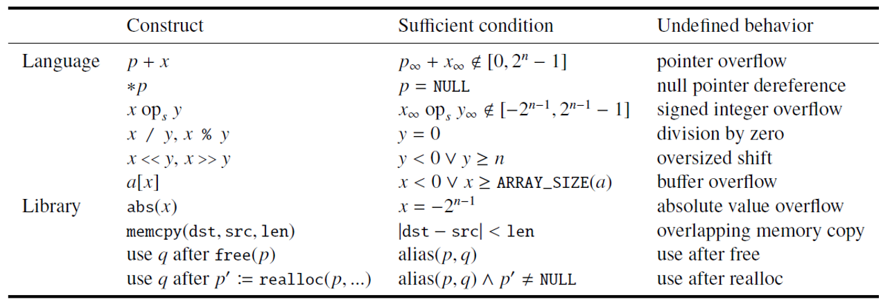
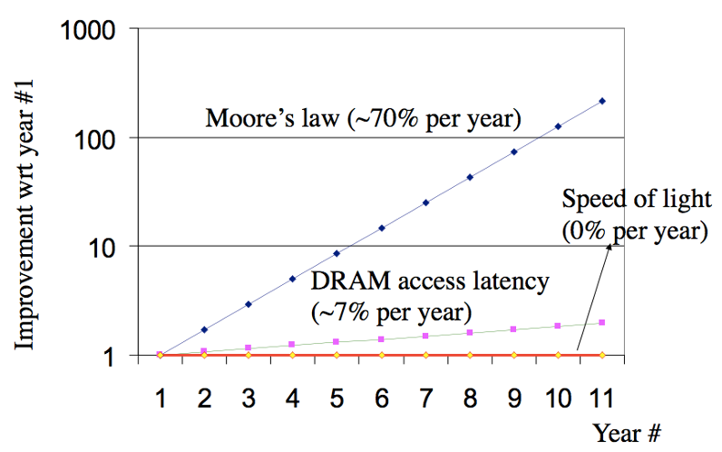
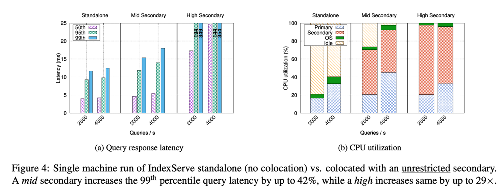
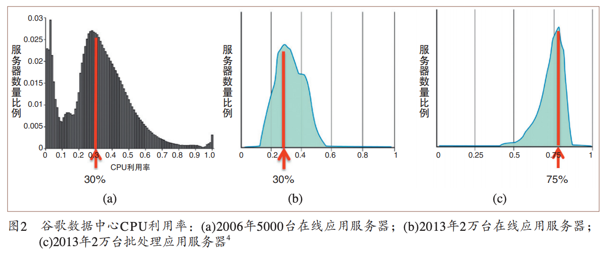

import OfficePreview from '@site/src/components/OfficePreview/index';

<OfficePreview place = "/ppt/CSE-01-intro.pptx"/>

## 第一章 简介

> CSE 每年都会做一些改动，每年上课内都不太一样。上课就跟 build 一个很大的系统一样，很多时候他必须得 cope with complexity 复杂性

### 一、数字世界

#### 1）两个视频

两个视频：重点并不在于notion，而不在于ChatGPT，而在于这两个人都是数字生成的，就是他们所说的每一句话，他们的每个表情、每个动作的话其实都是生成的，那么并不是。

我们会发现这个数字世界已经把这个真实世界和这个数字的虚拟世界进行一些融合，而当你在这个融合的世界里面看到对面的一个人的时候，其实你可能分辨不出来它是一个真的人和一个假的人。

意味着更高的效率，意味着不需要经过长途的跋涉，我们就可以看到一个我们想看的一个人，意味着很多很多的这个可能性。

#### 2）蓝屏/事故?

几个例子：

- 叮叮当时撑到最后还是崩溃了，支付宝在 2015 年的5月 27 日的下午，曾经大规模的这个宕机。整个支付宝如果你要支付的话，它就处于一个中间，有一个spin，就是有一个圆圈在一直转，然后就告诉你无法支付。那为什么呢？是因为杭州市的萧山区这个光纤被异常的挖断。
- 光纤被挖断，会在我们这门课里面多次出现，我觉得我们甚至应该给我们这门课设计一个logo，就是一个光纤被铲子挖断的一个瞬间。这个画面可以提醒我们这个意外无处不在，复杂事件很多可能都会出现。
- 更严重的这个事故（导致了人命的这个这个丧失）：Therac-25 事件，由于软件的bug（race Condition，ICS讲过），导致了它一个机器的辐射量过大，本来是用辐射去精准的消除一些肿瘤细胞，但是如果辐射过大的话，就会导致整个人接受不良的辐射，而受非常不可逆的这个损伤。
- Ariane 5 号火箭有一个浮点 FLOATING point 的一个bug，起飞之后的话爆炸了（ICS的课程例子哦这个是！）
- Jeep自由光系统存在入侵风险，菲亚特克莱斯勒汽车公司召回140万辆汽车
- 我们对于系统复杂性的驾驭是不是真的能够支撑我们一步一步的往到这个这个不可逆的方向这个前进？所以我们就要谈一下 system 和这个complexity。

#### 3） System 与 Complexity

-  system：其实是一个不太好定义的这么一个概念， system 就是一组component， component 他们是具有和环境交互的一组特定的行为，通过这个接口和环境有一组特定的行为。
  - 外部：复杂
  - 内部：复杂
- complexity：这里的一个矛盾是什么呢？就是我们人脑的理解能力是有限的，虽然大家的理解能力会有些差异，但这个差异的话依然是可在一个相对来说比较小的范围之内，而系统的复杂度则是没有边界，它可以很复杂，所以我们的脑子就没有办法去理解这个系统到底是如何 work 的
  - Linux的代码不断增加，合在一起都 2000 多万行代码。差不多和一个老鼠的基因是差不多的。

系统的思维：

- 当我们研究一个分子的时候，我们能够得到这个分子的什么属性？我们能够得到它的质量，它的方向，最后变成它的这个动量
- 一瓶气体里面有很多个气体的分子，这个时候如果我们还是用研究一个分子的方式去研究这个瓶子里面的气体，显然是不对的，因为它太复杂了。
- 所以我们研究温度，大家还记得温度的定义吗？温度体现出来的是气体分子的平均运动速度，对不对？
- 你说我这有一个气体分子，它的温度是多少没有意义，但是当我们有一瓶气体的时候，在宏观上就体现出来了一个在微观上所不具备的一个属性，可以被我们人测到的一个属性，而且能够反映出速度的这样一个属性，那就是那是温度。
- 当我们的代码行数从很少的几十行，我们平时写的 lab 几十行、几百行到几十万行、几百万行、几千万行的时候，会不会出现一个类似于温度这样的属性，让我们去测量这个系统
- 而不是一行代码去看待这个系统。当我们把一个系统里面的 CPU 的数量从一个和变成几十个、几百个、上千个核，当我们有一个很大的集群，有几十万个核的时候，这个系统，这个cluster，这个 data center，它所体现出来的一些 property 就不再是一个核所体现出来的property。
- 网络，对于两个节点组成的网络和对于整个世界、整个地球上的Internet，所以这么多节点连在一起形成的网络，它们的属性是不是也会产生这样一些新的这个property？
- 还有就是 Web Server，我们在 ICS 的时候做过一个 lab 叫做 Web Server，你们的 Web Server 能够支撑每秒钟多少个CLient？如果说要到几百万，那可能一台机器这个 Web Server 它就不是我们这么去设计的。所以这个量的变化带来了质的变化
- 当一个系统复杂到几千万行代码，我们有哪些类似于温度的 property 可以去形容、描述、追求的这样一些属性？这就是我们这门课的两个轴
  - 第一个轴（x轴）：不同的System
  - 第二个轴（y轴）：不同的property（上面说的类似温度的）

### 二、14个属性

#### 1）总述

- 正确性、时延、吞吐量（并发）、Scalability（延展性）、Utilization（把资源好好的利用起来）
- Performance Isolation（性能隔离、互补干扰）、Energy Efficiency高效
- Consistency、Fault Tolerance、Security、Privacy、Trust、Compatibility、Usability

#### 2）Correctness正确性

> 正确性大家觉得是一个最基本的要求，应该是一件很容易判断的事情。事实上其实并没有那么容易判断。有人说：「It's not a bug, but a feature」

- 例子一：

  - 比如说在 Windows 11里面，当你打开一个资源管理器的时候，双击F11，性能可以提高400%（这是六天前的一个新闻）
  - F11 就全屏，再按一下就退出全屏，它差不多就是这样一个过程。好，那么对于这样一个过程来说的话，为什么它就快了？全屏的时候他一下子就觉得优先级高了，然后给他更多的资源还是什么，对吧？让他的这个响应速度变快一些。你们觉得这是 bug 还是feature？

-  例子二：

  - Linux登录的界面按 28 下推位键，你就可以不用密码登录了。但这个 bug 已经被 fix 了，大家现在去看的话，应该已经没什么太大的这个作用了。

- 例子三：指针溢出与Undefined behavior

  - 看下面的代码：

    ```c
    char *buf = xx;
    char *bufend = xx;
    if(buf + len >= bufend)
      	return; // 说明因为输入过长，导致越过了buffer end
    if(buf + len < buf)
    		return; // 说明产生了溢出，len的长度可能过大
    // 开始往buf[0]~buf[len - 1]里面写入数据
    ```

  - 这个代码看似非常好，考虑了所有的情况，但是`gcc`的人建议说：把第五行、第六行代码删掉为什么？

  - 指针溢出是一种C语言手册里面的Undefined behavior，也就是说Undefined behavior的最终行为是要depends的，看情况来说的，比如随着编译器优化的情况，会有不同的汇编代码。

  - 编程的时候要小心，不要写出Undefined behavior的行为

  - 这个工作当时用了很多不同版本，包括GCC，包括不同版本，包括加杠 O1 跟杠O1，O2，O3，一个个去试发现都不一样，对于undefined， behavior 都是depends，而且它还没有一个warning，所以这其实给我们很大很大的一个震撼。我当时看到这篇论文的时候，我觉得从此之后安全感就很难建立起来了。



> 补充：[Compiler Explorer (godbolt.org)](https://godbolt.org/)这个网站可以用来测试不同的编译器。如下图所示。
>
> - 没有开O2的时候，是会老老实实的计算x+1的值
> - 开了O2的时候，直接就会`ret 1`，所以这就是Undefined behavior


大家想一想，我们的自动驾驶的软件是通过 GCC 编出来的，你真的会一行汇编的去看是不是编出来的和你 c 写的代码一样吗？所以我想说的一点是，关于 correctness，有时候哪怕是表现，我们也不知道它是 bug 还是feature。有时候对于一个我们看上去是完全正确的一个代码，但实际运行的时候我们看不到的二进制，它可能和我们所写的代码是不一样的，而不同的编译器的行为也有可能是不一样。

#### 3）latency延迟

这个 latency 它很难去优化，我们说如果我们要有更多的性能，我们第一反应是卖更多的机器就可以了，但是要缩短Latency，是一件很难的事情。

- 摩尔定律告诉我们，单位面积上我能够集成的晶体管的数量18个月翻一番
- 但是 DRAM 的 access latency的话却只有每年7%的优化，这个是十倍的这个差距，这个十倍的差距的话会带来非常大的一个gap。
- 越往后大家看这个随着年数增加，它越往后它 gap 就越大。



#### 4）Throughput / Capacity

> latency延迟是性能里面最难压缩的一个，其次是Throughput / Capacity。

- 单位面积晶体管数量增加，本身就是一种 Capacity的增加
-  7 纳米、 5 纳米、 3 纳米、两纳米就不断在工艺在减小，意味着单位面积又可以增加，所以它其实是我们的预期，其实是一直就指数结尾上涨。
- 但是到现在我们说这个快到头了，所以美国人才要各种限制了，那快到头了它也增长不了太多了，那怎么办？那只能给你卡一下，所以这是他们说的这个点。

#### 5）Scalability

> CPU的核心数量越多越好吗？不是

这段代码运行在华为的一台服务器，是华为的这个鲲鹏系列的服务器上，它其实有 64 个核心。我们写了一个Benchmark，这个 Benchmark 它会有一把锁，就这个 Benchmark 就是一个应用程序，它其实是要更新一个东西，然后大家因为同时要更新，所以要拿锁。

我们ICS的时候学过锁，理想性能是什么呢？是随着CPU核数的增加，性能的话应该是成正比，但是超过了12个核心的时候，直接就掉到反而不如一个核心！为什么？

多核的时候，为了保证每个核看到的内存都是最后一次写入，必须要在多核之间有一个协议，告诉所有的核哪个数被改了，而这个数是什么呢？就是这个锁，当这个锁在一个多核情况下被修改的时候，有大量的 Cohere 在这个多核之间传递，而这个速度就会大大的这个降低


#### 6）Performance Isolation

> 性能隔离，如下图所示



一个应用程序在单独跑的时候，延迟比较低，但是和一个稍微吃性能的程序一块跑，延迟就被带大了，如何优化这个也是我们要考虑的。

#### 7）utilization

我们国家有很多数据中心，问题是我们建了这个数据中心之后，它的 CPU 利用率常年维持在30%，服务器数量的这个比例也是差不多。2013 年上到这个 75% 了，有些增长，但是依然是离我们希望的 90% 或者更高还有很大的差距。

我们一边在说我们需要算力对不对？我们需要吹一个大模型出来，一边这边又是这个都没用满，这是一个矛盾。这就是我们的utilization没怎么提高



#### 8）Energy Efficiency

台式机、服务器插电使用，无所谓。但是笔记本、手机，这种我们就要考虑电池了。怎么样去实现一个系统的这个 energy efficiency

#### 9）Compatibility兼容性

系统会不断的进化，但是如果我们进化之后的结果是不再兼容，那就要做好非常非常沉重的这个后果的这个预期。

Itanium芯片看上去很高级对吧？听过同学给我举下手？没听过？说明它是一个很失败的处理器。是英特尔当时推出的最先进的一款 CPU 比当时的奔腾还要先进。本来是要取代奔腾，但是当时是 32 位到 64 位转型的一个关键的时间节点，当时 32 位大家都知道不够了，但是怎么上 64 位，有两种方案。

第一种方案我们完全搞一套新的 64 位的指令集，使用了当时最先进的叫 VLIW very long instruction word 超长指令集。这个超长指令集它的作用是把 CPU 造的越快越好，尽可能快，不要去在 CPU 内部做各种各样复杂的逻辑，而是把一些重要的一些优化让编译器去做。这个理念到现在为止还是很先进的，就是让软件充分的去分析程序并行的可能，然后生成的这个代码又已经是最优的了，然后处理器只要想着我怎么去运行这个代码就行了，而不是在处理器的内部再去做一些这个优化。而以前奔腾的话就处理器内部有很多优化的这个点，导致它性能很多时候受到了一些这个掣肘。

但是这条路的话就意味着和以前的所有的这个 X86 的这个指令都不兼容，你只能通过二进制翻译的方式去做这个事。这个 compatibility 就导致了这个安藤（Itanium）最后就失败了。

成功的是谁？成功的是AMD，所以今天我们的 64 位的处理器叫 AMD64，是因为 AMD 就比较保守，他所提出的 64 位的这个方案的话是兼容以前的 32 位方案，这样的话就存活下来。以前英特尔一直嘲笑MD，说你们完全没有任何技术，所有的 X86 都是我一开始发明，你们没有提出过一条新指令，这是以前嘲笑 AMD 的时候，结果有了 AMD 64 之后，他成为了事实标准，英特尔不得已 follow 的这个标准。

从此之后英特尔说我们叫他改个名，我们叫 X 8664 好不好？然后所以我们有时候可以看到两个，一个叫 X 8664，还有一叫 AMD64。

####  10）usability

早期的 Windows phone，当时这个叫PDA，个人数字助理拿起一个PDA，眼睛不好的老先生就会眯着眼睛看，为什么呢？因为字很小，然后手还没法直接点，为什么呢？一手点容易出错，所以要从旁边抽一支笔出来，然后去戳那个屏幕。这个还是基于微软他以前的这种鼠标键盘的这种操作的思路，他觉得操作这个东西总得有一个像鼠标一样东西去点双击。

但是我们知道 iPhone 一代完全和这个不一样，对不对？随便你拨打都能操作，你按错了一点点也没事，它可以自动纠错过来，充分考虑到手指的这个点，这是 usability 带来这个好处，

所以我们一个好的系统，它的 usability 也非常重要，否则的话就会像今天的 Windows phone 一样，像昨天的 Windows phone 一样被时代淘汰。

#### 11）Consistency

在12306有没有可能买到两张一模一样的票？事实上还真有。这是19 年6月10号的一个新闻。为什么会两个人买到一张票？那其实很简单对不对？就是一个 race 对不对？就是一个竞争条件，这个应该是减一的，两个减一同时来，不就变成这个减成- 1了？

Consistency 的代价非常大，就是你要达到consistency，在性能方面要做出相当大的一个妥协。有些公司有时候甚至会放弃Consistency。你发条朋友圈买了 MATE 60 了，刚到手，对，发了朋友圈，然后又开始看评论，你发现这个评论本来是 ABC 三个好友，然后你退出之后再进来发现变成A、C、B，然后你再退出，再进来发现又变成了这个ABC。那为什么他敢这么做？就是因为我们不会去记到底它原来是什么样，对不对？所以就算我告诉大家，大家也记不住到底变了没变。微信比我们更了解我们自己，他说既然这样，我就不做Consistency，性能还能快点，反正你们也不知道对不对？ 

微信朋友圈就是这么做的，那没必要，他说我又不是卖东西，对不对？卖了你不能卖它了，你要顺序换一换又怎么样？

#### 12）Fault Tolerance

容错这个话题我们都可以讲好久好久，为什么呢？因为错误每时每刻都在发生，我们前面说的自动驾驶等等都有可能发生。

这个宇宙射线如果我们把它给可视化之后，我会发现其实它是非常频繁。那么当我们的宇宙是一个高能粒子，打在我们的内存上之后，就有可能让内存上的 beat 发生一个flip，本来是 0 的就变成1了，本来是1的就可能变成0。这件事情本身注意并不是一件很罕见的事情，只不过我们很难去知道发生了这样的一件事情。

Cisco 公司有个bug，然后出了 bug 之后，别人就问你这个 Cisco 的这个交换机怎么回事？怎么这么质量不行？给我好好分析分析，写一个 bug report，我们避免以后避免这样的问题。那在这个 bug report 里面他就写了，说我这个问题就是有可能就是由 COSMIC radiation 触发了，就是我这交换机被高能宇宙射线

这件事情为什么我说它不是那么罕见？是因为当我们去访问内存的时候，当你频繁访问一行一条内存的时候，由于我们的内存是要充电的对不对？断电内存不就没了吗？他为了保证这个数据能够被你读到，它就会对这一行反复的充电，这样就有可能导致他的隔壁邻居的那一行电不够了，就会邻居这里的某一个 bit 发生leap。

如果我们以 12.3 兆每秒去测的话，大概有 2 万多个错误，这是十年以前的数据，今天我们的这 DDR 3 的数据， DDR 4 好很多了， DR 5 基本上就这个问题就是已经很难触发了。


